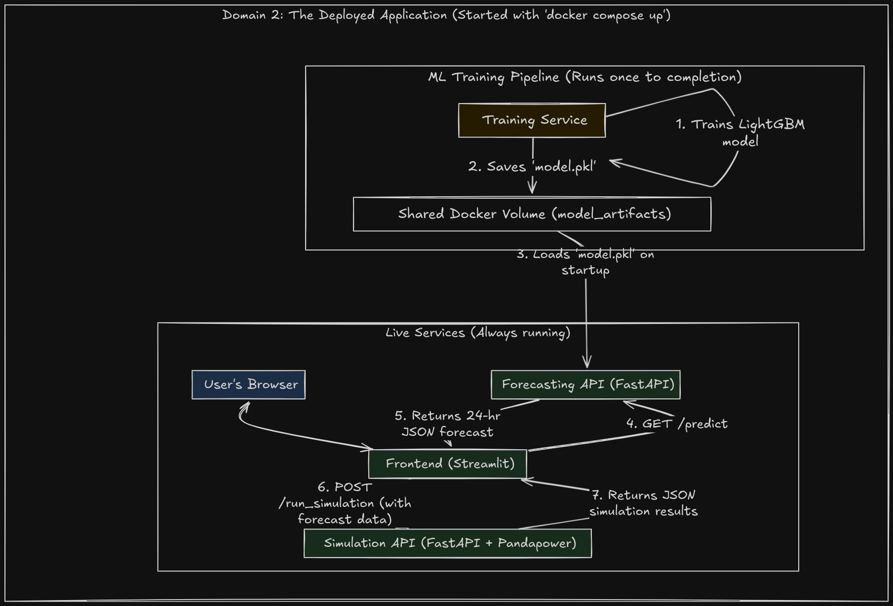
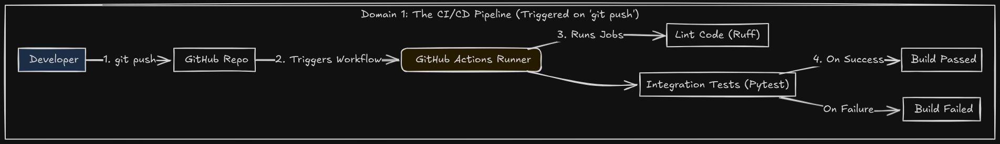

# Containerized Pravah

Hey, I built this project as a small version of Pravah

tl;dr: I built a miniature, working version Pravah to showcase my skills. It's a full-stack, AI-driven application that I containerized with Docker. It automatically trains a forecasting model, serves predictions via a FastAPI backend, runs a power grid simulation, and visualizes everything in a Streamlit frontend. The whole thing is tested with a CI/CD pipeline. You can run it yourself with a single docker compose up command.**This demonstrates how I approach MLOps, backend engineering, and building production-ready systems.**

## What I Built

**Production-Grade**: Everything runs in Docker containers with proper CI/CD. I wrote integration tests and set up GitHub Actions to catch issues early.

**Automated ML Pipeline**: I set up a complete train-and-serve workflow. The system automatically trains a demand forecasting model using LightGBM and serves predictions through a FastAPI endpoint.

**Microservice Design**: Rather than building a monolith, I split this into separate services - one for training, one for forecasting, one for grid simulation, and a frontend. Each service can be developed and scaled independently.

**Power Grid Simulation**: I integrated `pandapower` to run Optimal Power Flow simulations. Basically, the system figures out the cheapest way to generate electricity while keeping the grid stable.

**Web Interface**: Built a basic Streamlit frontend where you can actually interact with the system, run simulations, and see how different scenarios affect the grid.

## How It All Fits Together

I designed this as a microservice architecture using Docker Compose. Here's how the pieces work together:





The training container runs once to create the model, then the other services use that trained model to serve predictions and run simulations.

## Tech Choices I Made

I wanted to iterate fast but also make it look as production-level as possible, so I made these choices. To be honest, I was also limited by my i3 processor. Anyway, I tried my best.

- **FastAPI** for the backend APIs - it's fast, has great docs, and handles async well
- **LightGBM** for forecasting - gives good results without being overkill for this use case.
- **pandapower** for grid simulation - it's what actual power engineers use
- **Streamlit** - easy peasy frontends
- **Docker** for everything (literally) - makes deployment simple and consistent

## Getting It Running

I made this as simple as possible to run locally

### What You Need
- Docker and Docker Compose

### Steps
1. **Get the code:**
   ```bash
   git clone https://github.com/YOUR_USERNAME/YOUR_REPOSITORY.git
   cd YOUR_REPOSITORY
   ```

2. **Start everything:**
   ```bash
   docker compose up --build -d
   ```
   This builds all the images and starts the services. The training happens first, then everything else comes online.

3. **Try it out:**
   Open [http://localhost:8501](http://localhost:8501) in your browser after about a minute (training needs to finish first).

4. **Check the APIs (useless IMO):**
   If you want to see the auto-generated API docs:
   - Forecasting: [http://localhost:8000/docs](http://localhost:8000/docs)
   - Simulation: [http://localhost:8001/docs](http://localhost:8001/docs)

5. **Clean up when done:**
   ```bash
   docker compose down --volumes
   ```

## Testing What I Built

I wrote integration tests to make sure the APIs actually work together properly.

With the system running:
```bash
python3 -m venv venv
source venv/bin/activate
pip install -r tests/requirements.txt
pytest
```

## What I'd Add Next

This is definitely a foundation I could build on. Couldn't do all of this because it would have been overkill. Some ideas I have:

- **Better MLOps**: Right now I'm using a simple shared volume for the model. I'd probably integrate MLflow for proper model versioning and experiment tracking.

- **More Realistic Scenarios**: The line failure simulation is partially implemented and not functional as of now. I'd love to finish that to show how the grid responds to equipment failures.

- **External Data**: Weather data would make the forecasting much more accurate. I have ideas about integrating NOAA APIs.

- **Cloud Deployment**: I built this to be deployment-ready. Next step would be getting it running on AWS ECS or Google Cloud Run.

- **Monitoring**: In production, I'd add Prometheus and Grafana to track performance and catch issues.

## Why I Built This

To get hired. Thank you for reading till here!